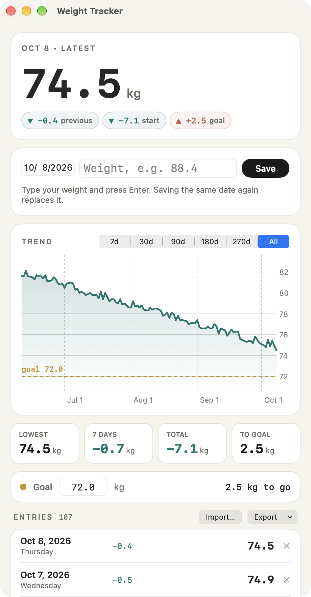

# Weight Tracker for macOS

A small, private weight log for the Mac, built with SwiftUI and Swift Charts.
Available in **English** and **Turkish**.

**[Türkçe README](README.tr.md)**

<p>
  
</p>

*The screenshot shows the built-in demo data, not real measurements.*

## Download

1. Download **WeightTracker-1.0.zip** from the [latest release](https://github.com/mustafacicek-eee/weight-tracker-macos/releases/latest).
2. Unzip it and move **Weight Tracker.app** to your **Applications** folder.
3. Open it. The first time, macOS shows a warning that it can't verify the app. That's because the app isn't notarized by Apple. To allow it:
   1. Close the warning.
   2. Go to **System Settings → Privacy & Security**, scroll down to **Security**, and click **Open Anyway**.
   3. Enter your password.

   After that, the app opens normally ([Apple's guide](https://support.apple.com/guide/mac-help/open-a-mac-app-from-an-unknown-developer-mh40616/mac)).

The download needs a Mac with Apple silicon (M-series) and macOS 14 Sonoma or later. You can also [build it yourself](#build).

## Features

- **Quick entry.** Type your weight and press Enter. Saving the same date again replaces that day's entry. Both `88.4` and `88,4` work.
- **Trend chart.** 7 / 30 / 90 / 180 / 270 days or all time, with your goal as a dashed line. Hover over the chart to see a day's weight and its change.
- **At a glance.** Latest weight with the change since the previous entry, since the start and to the goal; lowest weight, 7-day change, total change and what's left to the goal.
- **Goal.** Set a target weight; the app shows how much is left.
- **PDF report.** A multi-page A4 report with a summary, the chart and every entry (**⌘P**).
- **Import and export.** CSV or JSON in both directions (**⌘O** to import). Imports merge by date.
- **Undo.** A deleted entry can be restored right away.
- **Automatic backups.** Before the first change of each day the data file is copied to a daily backup; the last 30 are kept. If the data file is ever damaged, it's set aside and the newest good backup is loaded.
- **Two languages.** Follows your Mac's language by default. You can also switch between System / Türkçe / English from the app menu (**Weight Tracker → Language**) or at the bottom of the window. The change applies instantly.

## Privacy

- Your data stays on your Mac. The app has no network code, no analytics and no account.
- Entries are stored in `~/Library/Application Support/KiloTakibi/kilo_takibi.json`, with daily backups in the `yedekler` folder next to it. (The folder keeps the name of the app's first, Turkish-only version so existing data keeps loading.) **File → Show Data Folder** opens it.
- The app starts empty. No sample or personal data is bundled.

## Requirements

- macOS 14 Sonoma or later
- Xcode (or the Command Line Tools), to build

## Build

```bash
git clone https://github.com/mustafacicek-eee/weight-tracker-macos.git
cd weight-tracker-macos
./build.sh              # → build/Weight Tracker.app
./build.sh --install    # also copies it to /Applications
```

There's no Xcode project: `build.sh` compiles `Sources/*.swift` with `swiftc`, packages the `.app`, signs it ad-hoc and writes a test PDF from generated sample data.

To try the app without touching your own data, start it in demo mode:

```bash
"build/Weight Tracker.app/Contents/MacOS/WeightTracker" --demo
```

Demo mode shows generated sample data and saves nothing.

## Project structure

```
Sources/
├── App.swift            # App, menus and the main window
├── Model.swift          # Entries, storage, backups, import/export, demo data
├── PDFReport.swift      # PDF report
└── Localization.swift   # Language switching, About panel
Resources/
├── en.lproj/            # English strings
├── tr.lproj/            # Turkish strings
└── AppIcon.icns
Info.plist
build.sh
```

### Adding a language

1. Copy `Resources/en.lproj` to `Resources/<code>.lproj`, for example `de.lproj`, and translate the values.
2. In `Localization.swift`, add the code to `LanguageManager.supportedCodes` and add a case to `AppLanguage`. Then handle the new case in `AppLanguage.pickerLabel`, `LanguageManager.resolveCode(for:)` and `LanguageManager.locale`.
3. Add the code to `CFBundleLocalizations` in `Info.plist` and to the language loop in `build.sh`.

## Author

**Mustafa Çiçek**
[GitHub](https://github.com/mustafacicek-eee) · [LinkedIn](https://www.linkedin.com/in/mustafacicek-eee/)

## License

[MIT](LICENSE)
