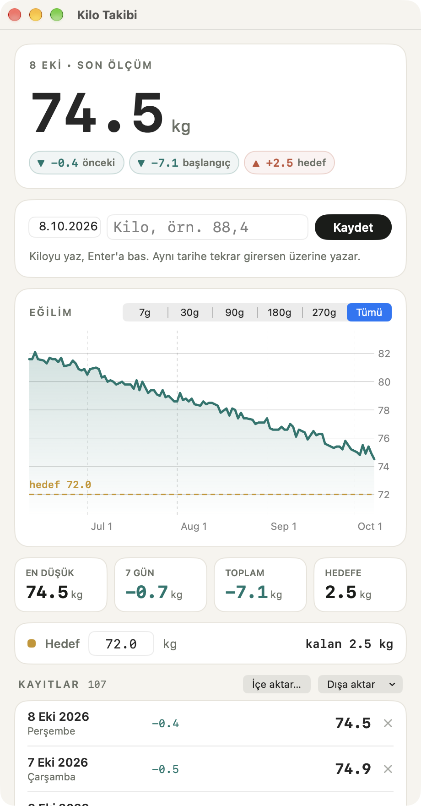

# Kilo Takibi (macOS)

Mac için küçük ve gizliliğe önem veren bir kilo kayıt uygulaması. SwiftUI ve Swift Charts ile yazıldı.
**Türkçe** ve **İngilizce** kullanılabilir.

**[English README](README.md)**

<p>
  
</p>

*Ekran görüntüsünde gerçek ölçümler değil, uygulamanın demo verileri var.*

## İndirme

1. [Son sürümden](https://github.com/mustafacicek-eee/weight-tracker-macos/releases/latest) **WeightTracker-1.0.zip** dosyasını indir.
2. Zip'i aç ve **Weight Tracker.app**'i **Uygulamalar** klasörüne taşı.
3. Uygulamayı aç. İlk açılışta macOS uygulamayı doğrulayamadığını söyleyen bir uyarı gösterir. Bunun nedeni uygulamanın Apple tarafından onaylanmamış (notarize edilmemiş) olması. İzin vermek için:
   1. Uyarıyı kapat.
   2. **Sistem Ayarları → Gizlilik ve Güvenlik** bölümünde aşağı inip **Güvenlik** kısmındaki **Yine de Aç** düğmesine tıkla.
   3. Parolanı gir.

   Bundan sonra uygulama normal şekilde açılır ([Apple'ın rehberi](https://support.apple.com/tr-tr/guide/mac-help/mh40616/mac)).

İndirilen sürüm Apple silicon (M serisi) işlemcili bir Mac ve macOS 14 Sonoma ya da üstünü gerektirir. Uygulamayı [kendin de derleyebilirsin](#derleme).

## Özellikler

- **Hızlı giriş.** Kiloyu yaz, Enter'a bas. Aynı tarihe tekrar girersen o günün kaydı güncellenir. `88,4` de `88.4` de olur.
- **Eğilim grafiği.** 7 / 30 / 90 / 180 / 270 gün ya da tüm dönem; hedef kesikli çizgiyle gösterilir. Grafiğin üzerine gelince o günün kilosu ve değişimi görünür.
- **Tek bakışta.** Son kilo; önceki kayda, başlangıca ve hedefe göre fark; en düşük kilo, 7 günlük değişim, toplam değişim ve hedefe kalan.
- **Hedef.** Hedef kiloyu gir, uygulama ne kadar kaldığını gösterir.
- **PDF rapor.** Özet, grafik ve tüm kayıtları içeren çok sayfalı A4 rapor (**⌘P**).
- **İçe ve dışa aktarma.** İki yönde de CSV ya da JSON (**⌘O** ile içe aktar). İçe aktarılan kayıtlar tarihe göre birleştirilir.
- **Geri alma.** Silinen bir kayıt hemen geri alınabilir.
- **Otomatik yedek.** Her günün ilk değişikliğinden önce veri dosyası günlük yedeğe kopyalanır; son 30 yedek saklanır. Veri dosyası bozulursa kenara alınır ve en yeni sağlam yedek yüklenir.
- **İki dil.** Varsayılan olarak Mac'in dilini kullanır. Uygulama menüsünden (**Weight Tracker → Dil**) ya da pencerenin altından Sistem / Türkçe / English arasında geçiş yapabilirsin. Değişiklik anında uygulanır.

## Gizlilik

- Verilerin Mac'inde kalır. Uygulamada ağ kodu, analitik ya da hesap yok.
- Kayıtlar `~/Library/Application Support/KiloTakibi/kilo_takibi.json` dosyasında, günlük yedekler yanındaki `yedekler` klasöründe durur. **Dosya → Veri Klasörünü Göster** bu klasörü açar.
- Uygulama boş başlar. İçinde örnek ya da kişisel veri yok.

## Gereksinimler

- macOS 14 Sonoma ya da üstü
- Derlemek için Xcode (ya da Command Line Tools)

## Derleme

```bash
git clone https://github.com/mustafacicek-eee/weight-tracker-macos.git
cd weight-tracker-macos
./build.sh              # → build/Weight Tracker.app
./build.sh --install    # ayrıca /Applications klasörüne kopyalar
```

Xcode projesi yok: `build.sh`, `Sources/*.swift` dosyalarını `swiftc` ile derler, `.app` paketini oluşturur, ad-hoc imzalar ve üretilmiş örnek verilerle bir test PDF'i yazar.

Kendi verilerine dokunmadan denemek için demo modunda başlat:

```bash
"build/Weight Tracker.app/Contents/MacOS/WeightTracker" --demo
```

Demo modu üretilmiş örnek verileri gösterir ve hiçbir şey kaydetmez.

## Geliştiren

**Mustafa Çiçek**
[GitHub](https://github.com/mustafacicek-eee) · [LinkedIn](https://www.linkedin.com/in/mustafacicek-eee/)

## Lisans

[MIT](LICENSE)
